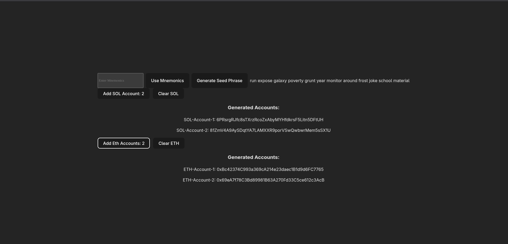
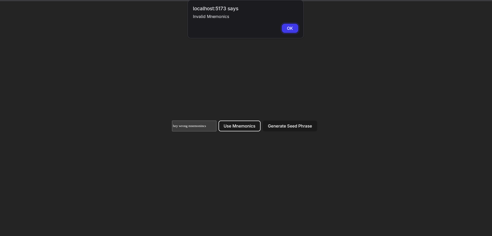

# Multi-Chain HD Wallet Generator 

🟢 **Live Demo:** [my-hd-wallet.netlify.app](https://my-hd-wallet.netlify.app/)
<br><br>
Bootstrapped with **React + TypeScript + Vite**

This project is a **React-based wallet generator** that supports both **Ethereum** and **Solana** keypair/address derivation from a BIP-39 mnemonic seed phrase.

---

## 📦 Tech Stack


- [bip39](https://www.npmjs.com/package/bip39) for seed phrase generation and validation
- [ethers.js](https://docs.ethers.org/) for Ethereum HD wallet and address derivation
- [@solana/web3.js](https://www.npmjs.com/package/@solana/web3.js/v/0.30.8) for Solana keypair generation
- [ed25519-hd-key](https://www.npmjs.com/package/ed25519-hd-key) for Solana derivation paths

---

## 🚀 Features

- ✅ Generate a random 12-word mnemonic (128 bits of entropy)
- ✅ Input your own mnemonic (manual entry)
- ✅ Derive and display:
  - 🔹 Solana public key (from Ed25519 seed)
  - 🔸 Ethereum address (from secp256k1 keypair)
- ✅ Add multiple accounts using standard HD derivation paths:
  - Solana: `m/44'/501'/i'/0'`
  - Ethereum: `m/44'/60'/i'/0/0`
- ✅ Reset/clear all generated accounts
- ✅ Alerts for invalid mnemonic input

---

## 🧪 Derivation Paths

| Chain     | Path Example                  | Standard |
|-----------|-------------------------------|----------|
| Solana    | `m/44'/501'/0'/0'`            | Solana BIP44 |
| Ethereum  | `m/44'/60'/0'/0/0`            | Ethereum BIP44 |

---


---

## ▶️ Usage

### 1. Clone & Install

```bash
git clone https://github.com/GeekyProgrammer07/hd-wallet.git

cd hd-wallet

npm install

npm run dev
```

## 🖼️ Demo UI Flow

1. **Enter or generate** a mnemonic using the input or "Generate Seed Phrase" button  
2. Click **“Add SOL Account”** or **“Add ETH Account”** to generate wallets  
3. View derived addresses listed below  
4. Click **"Clear"** to reset the account list  

---

## 📌 Example Output


<br><br>



---

## 🔒 Disclaimer

This tool is for **development/learning purposes** only.  
Do **not** use it to generate real wallets for holding actual funds.  
Always secure your mnemonics with proper encryption and offline storage.
